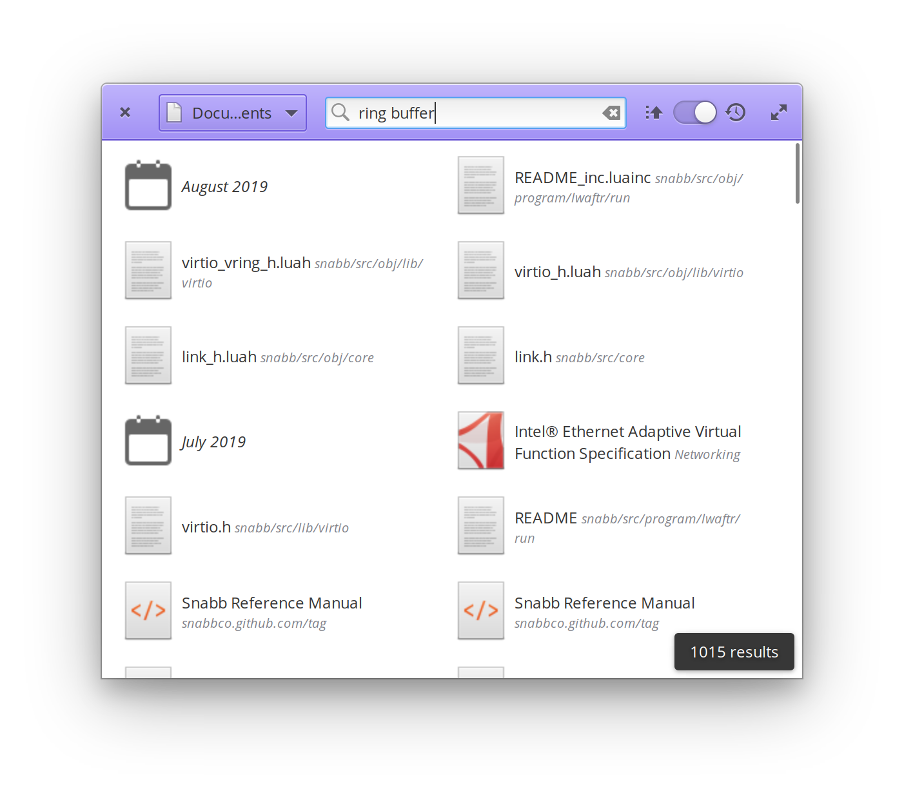
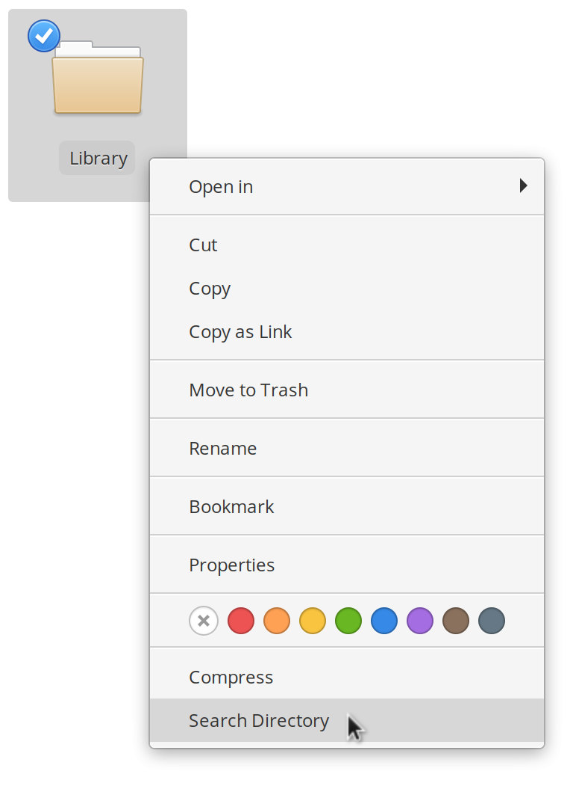

# Recall

Full-text file search for your document library.

Simple [recoll](https://www.lesbonscomptes.com/recoll/) frontend for
[ElementaryOS](https://elementary.io/).

## Notes

- Recall manages a dedicated recoll configuration directory in
  `~/.config/com.github.eugeneia.recall` (i.e., it does not overlap with the
  default recall configuration directory)

## Screenshots

